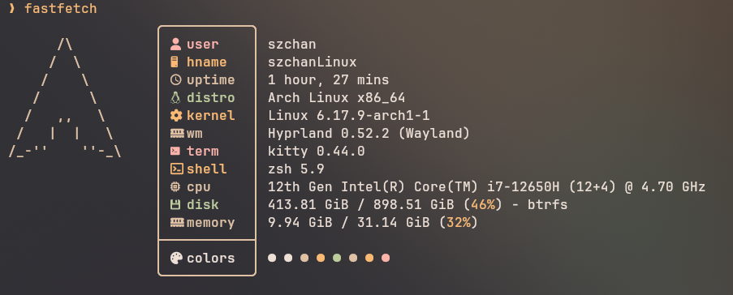

# MyFastFetch Configuration

这是一个 [fastfetch](https://github.com/fastfetch-cli/fastfetch) 配置仓库，提供了美观实用的系统信息显示配置。

## 效果图



## 安装

### 前置要求

- 已安装 [fastfetch](https://github.com/fastfetch-cli/fastfetch)

### 安装命令

1. 克隆此仓库：
```bash
git clone https://github.com/szchan/myfastfetch.git
```

2. 复制配置文件到 fastfetch 配置目录：
```bash
cp myfastfetch/config.jsonc ~/.config/fastfetch/config.jsonc
```

3. 运行 fastfetch 查看效果：
```bash
fastfetch
```

## 配置文件位置

配置文件应该放在：
```
~/.config/fastfetch/config.jsonc
```

如果 `~/.config/fastfetch/` 目录不存在，请先创建：
```bash
mkdir -p ~/.config/fastfetch
```

## 自定义配置

编辑 `~/.config/fastfetch/config.jsonc` 文件来自定义显示内容。

## License

GPL-2.0 License © 2025 
